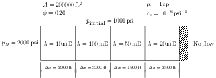

# Homework Assignment 14

## Instructions

If you didn't realize it, the [CMG Tutorial on 1D single-phase flow](https://youtu.be/jt5euIPuB6Y) was also the exact problem we wrote our own Python code for in [Assignment 11](https://github.com/PGE323M-Fall2018/assignment11/blob/master/assignment11.ipynb).  With some easy modifications, we can also solve [Assignment 13](https://github.com/PGE323M-Fall2018/assignment13) in CMG.  Recall the problem schematic



The easiest way to work this problem in CMG is to work through the [tutorial](https://youtu.be/jt5euIPuB6Y) saving your input file as `assignment14.dat`.  Then edit the input file in a text editor and manually change the lines related to grid spacing and permeability.  The permeability line should look something like

```
PERMI  20000 10 100 50 20
```

In this case, 20000 is the largest permeability value allowed in the "fake" grid block without causing an error in CMG.  Edit the line related to grid spacing (keyword: `DI IVAR`) in an appropriate way as well.  Save the input file and run.  Remember to run the simulation for 3 days in 1 day increment time steps.  Once the program has finished running without error, there should be a file `assignment14.out` in the run directory.  Copy this file into this repository, add, commit, and push to Github for submission.

## Testing

If you would like to check to see if your solution is correct, run the following commands at the Terminal command line in sequence:

```bash
>python test.py
```
